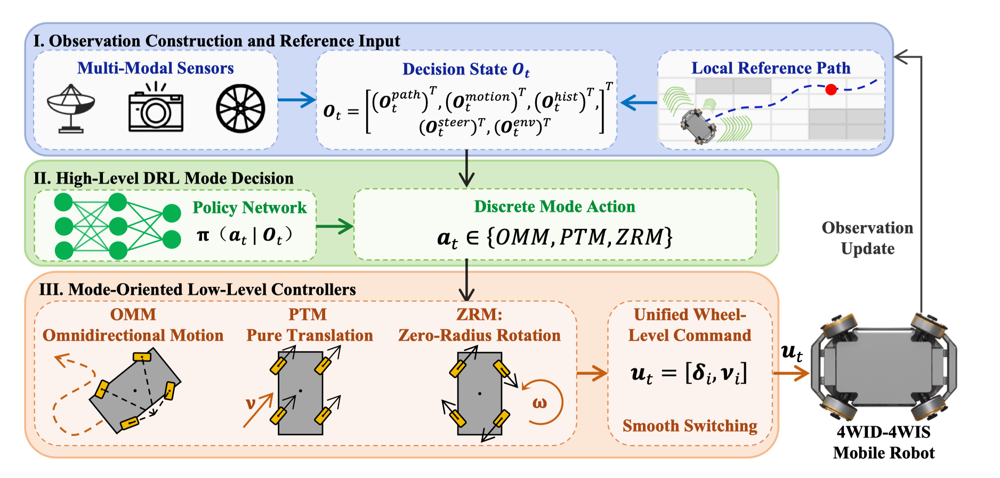

# WIS-DRL

[English](README.md) | [简体中文](README_zh.md)

[](LICENSE)


Hierarchical hybrid motion control for overactuated 4WID-4WIS mobile robots.

WIS-DRL is the appendix code for a hierarchical hybrid framework that combines PPO-based mode selection with constrained low-level control for 4WID-4WIS robots. The repository follows a standard open-source layout: one script per workflow, clear map aliases, reproducible benchmarks, and plotting utilities for paper-style figures.

**Fig. 1. Overall architecture of the proposed hierarchical hybrid framework.**




## Table of Contents

- [Overview](#overview)
- [Highlights](#highlights)
- [Architecture](#architecture)
- [Repository Contents](#repository-contents)
- [Repository Layout](#repository-layout)
- [Supported Maps](#supported-maps)
- [Installation](#installation)
- [Quick Start](#quick-start)
- [Outputs](#outputs)
- [Notes](#notes)
- [Citation](#citation)
- [License](#license)

## Overview

The control stack uses a two-level design:

- The upper layer observes path geometry, vehicle motion, mode history, steering history, and local clearance.
- A PPO policy chooses one of three discrete motion modes: OMM, PTM, or ZRM.
- The lower layer converts the selected mode into feasible wheel-level commands.
- The repository includes the hierarchical policy, a pure MPC baseline, a rule-based switcher, and an end-to-end continuous RL baseline for comparison.

This design is intended to improve:

- Training stability
- Decision interpretability
- Control feasibility under actuation constraints
- Execution efficiency on complex maps

## Highlights

- Hierarchical DRL + MPC control for overactuated 4WID-4WIS robots
- Three motion modes with clear semantic mapping to code modules
- Built-in curriculum over `map_a`, `map_b`, and `map_c`
- Reproducible training, testing, benchmarking, and plotting scripts
- Standalone AFM, APT, AZR, and NMPC demos for paper reproduction

## Architecture

The figure above mirrors the paper’s main pipeline and the code organization in this repository.

### Paper Term vs. Code Module

| Paper term | Code module | Role |
| --- | --- | --- |
| OMM | `AFM` | Omnidirectional motion with single-track equivalent NMPC |
| PTM | `APT` | Pure translation with geometric body-frame control |
| ZRM | `AZR` | Zero-radius rotation with geometric in-place steering |
| Upper-layer DRL | PPO mode selector | Chooses among OMM / PTM / ZRM |
| Lower-layer controller | `AFM` / `APT` / `AZR` | Produces feasible low-level commands |
| Observation state | `ModeEnv` observation | Path preview + motion state + history + clearance |

## Repository Contents

- `train.py` trains the PPO-based mode selector.
- `test.py` evaluates a trained policy and exports detailed traces.
- `train_end_to_end_continuous_rl.py` trains the direct wheel-level continuous baseline.
- `benchmark_policy_vs_mpc.py` compares PPO, pure MPC, rule-based switching, and continuous RL.
- `benchmark_afm_module.py` benchmarks the standalone AFM module on all paper maps.
- `main_controller.py` and `run_mode_switch.py` provide scripted mode-switch demos.
- `nmpc_path_tracking.py` runs standalone NMPC tracking for the AFM baseline.
- `draw_map.py` renders the tri-mode composite map.
- `plot_results.py` turns logs into publication-style figures.

## Repository Layout

```text
WIS-DRL/
├── controllers/                  # AFM, APT, AZR, and robust NMPC controllers
├── env/                          # Training and evaluation environments
├── maps/                         # Map definitions and reference paths
├── scripts/                      # Shell wrappers for common workflows
├── train.py
├── test.py
├── train_end_to_end_continuous_rl.py
├── benchmark_policy_vs_mpc.py
├── benchmark_afm_module.py
├── main_controller.py
├── run_mode_switch.py
├── nmpc_path_tracking.py
├── draw_map.py
├── plot_results.py
├── README.md
├── README_zh.md
├── requirements.txt
└── LICENSE
```

## Supported Maps

`MapManager` exposes the following map types:

| Map name | Description | Notes |
| --- | --- | --- |
| `map_a` | AFM open-track map | Used for OMM / AFM experiments |
| `map_b` | APT alignment map | Used for PTM / APT experiments |
| `map_c` | AZR reorientation map | Used for ZRM / AZR experiments |
| `tri_mode_composite` | Composite benchmark map | Default evaluation map |

If you omit `--map` in `train.py`, the training script uses the built-in curriculum over `map_a`, `map_b`, and `map_c`.

## Installation

Recommended Python version: 3.10 or 3.11.

```bash
cd WIS-DRL
python3 -m venv .venv
source .venv/bin/activate
python -m pip install --upgrade pip
pip install -r requirements.txt
```

If you want TensorBoard separately:

```bash
pip install tensorboard
```

The shell wrappers in `scripts/` automatically source `scripts/env.sh`, which keeps matplotlib and font caches inside `.cache/` and changes to the project root before launching Python.

## Quick Start

### Train the mode selector

Use the default built-in curriculum:

```bash
bash scripts/train_mode_switch.sh --timesteps 500000
```

Train on a single map instead:

```bash
python train.py --timesteps 500000 --map map_a
```

### Evaluate a trained policy

```bash
bash scripts/test_mode_switch.sh \
  --model-path models/<your_model>/best_model.zip
```

To test a specific map:

```bash
python test.py \
  --model-path models/<your_model>/best_model.zip \
  --map tri_mode_composite \
  --episodes 20
```

### Train the continuous baseline

```bash
bash scripts/train_continuous.sh --total-timesteps 800000
```

Or run it directly:

```bash
python train_end_to_end_continuous_rl.py
```

### Benchmark against MPC and rule-based switching

```bash
bash scripts/benchmark_policy_vs_mpc.sh \
  --model-path models/<your_model>/best_model.zip
```

To include the continuous baseline in the comparison:

```bash
bash scripts/benchmark_policy_vs_mpc.sh \
  --model-path models/<your_model>/best_model.zip \
  --continuous-model-path models/<continuous_model>/best_model.zip
```

### Run the standalone AFM benchmark

```bash
bash scripts/benchmark_afm_module.sh
```

### Draw the composite map

```bash
bash scripts/draw_map.sh
```

### Plot training and test results

```bash
bash scripts/plot_results.sh --log-dir ./logs/<run_dir>
```

If you already have test outputs:

```bash
bash scripts/plot_results.sh --test-results ./test_results/<run_dir>
```

## Outputs

Generated artifacts are written to the following locations:

- `models/` for checkpoints and run configs
- `logs/` for environment statistics and evaluation logs
- `tb_logs/` for TensorBoard runs
- `test_results/` for evaluation summaries and step traces
- `benchmark_results/` for comparison tables, plots, and CSV files
- `figures/` for maps and publication-style plots
- `outputs/` for demo trajectories and rendered figures

## Notes

- The repository is designed to run as a script bundle, not as an installable Python package.
- Omitting `--map` in `train.py` or `--map-type` in `train_end_to_end_continuous_rl.py` uses the built-in curriculum over `map_a`, `map_b`, and `map_c`; the explicit CLI map names are `map_a`, `map_b`, `map_c`, and `tri_mode_composite`.
- The AFM helper, APT demo, AZR demo, NMPC tracker, and benchmark scripts are preserved for paper reproduction and qualitative inspection.
- Fig. 1 is rendered from `figures/fig1.svg`; if you have the exact paper export, you can replace that file with a raster version.

## Citation

If you use this code in your work, please cite the corresponding paper.

## License

MIT License
